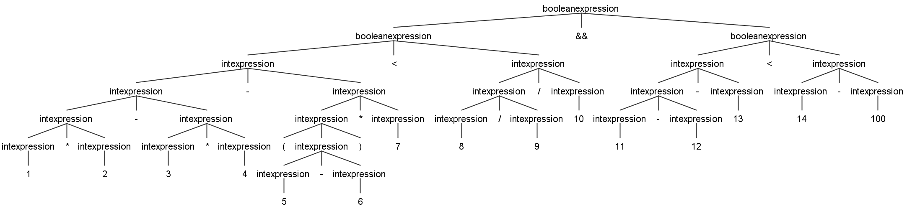
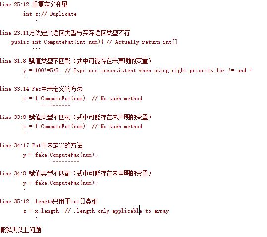

# 编译原理 MiniJava 编译器前端报告

Auther: 
王冬旭 13307130444 
玄远 12307130066

## 目录

* 一 项目要求及完成情况
* 二 项目总览
* 三 ANTLR简述
* 四 AST的生成
* 五 语法改动说明
* 六 AST及语义错误测试
* 七 检查过程说明
* 八 实现过程中的感想
* 九 项目完成体会

### 一 项目要求及完成情况
1. 正确的词法/语法分析，给出对应的文法文件2分 √  
    + MiniJava.g4
2. 输出正确的抽象语法树	5分 √
    + testProgram 中 10 个测试文件，生成的语法树在 result 中
3. 错误处理功能
	1. 提示错误类型（词法错误、语法错误、语义错误等）、出错位置等 5分 √
        + 词法错误，语法错误: ANTLR默认行为
        + 通过语法检查出常见的特定类型的错误
        + 部分语义错误：
        1.  创建变量\类\方法时的重复声明检查，并对变量作用域做了处理
        2.  使用变量\类\方法时的存在性检查，并对变量作用域做了处理
        3.  类继承错误（循环继承、未声明父类）
        4.  类型推导和类型检查：
            + 运算符
            + 数组下标
            + '=' 赋值
            + .length只能用于数组类型
            +  函数返回值类型不匹配
        5.  方法调用时参数类型、数目错误
            + 对于使用父类形参的方法，允许使用子类实参

	2. 错误修复  3分  √  
        + ANTLR默认行为 single-token insertion and single-token deletion
4. 发挥想象力，使编译器尽善尽美 5分 √ 
    + 修改了语法，使运算符具有优先级语义
    + 实现了变量\方法\类声明检查和类型检查
    + 对继承做了处理，类型检查时可以正确处理继承
    + 允许使用不同参数的函数的重载，在调用函数时正确处理子类参数
5. Project文档
    1. 使用语法（文法类型，有无改动语法、如何改动等），错误处理说明等 5分 √
        + 对修改的语法进行了介绍`
        + 对实现语义检查的代码进行了介绍
	2. 对本项目语法的使用工具的体会 5分 √ 
        + ANTLR简述
        + 项目完成体会
	
###  二 项目总览
使用ANTLR工具,为 MiniJava 构造一个编译器前端，将输入的 MiniJava 语言转化为抽象语法树；修改了语法，使运算符具有优先级语义；实现了类\方法\变量的声明检查，类型检查，处理了变量的作用域，正确处理同名函数的重载，正确处理继承；

开发环境：

本项目由两人协作：
+ MacOS 10.12 Visual Studio Code/ Windows10 64位 IntelliJ IDEA 14.1.3
+ Antlr 4.5.3

### 三 ANTLR简述
[ANTLR](www.antlr.org) (ANother Tool for language Recognition). 作者Terence Parr(University of San Francisco).

+ ANTLR 语言识别的一个工具 (ANother Tool for Language Recognition ) 是一种语言工具，它提供了一个框架，可以通过包含 Java, C++, 或 C# 动作（action）的语法描述来构造语言识别器，编译器和解释器。 计算机语言的解析已经变成了一种非常普遍的工作，在这方面的理论和工具经过近 40 年的发展已经相当成熟，使用 Antlr 等识别工具来识别，解析，构造编译器比手工编程更加容易，同时开发的程序也更易于维护。
+ 和大多数语言识别工具一样，Antlr 使用上下文无关文法描述语言。最新的 Antlr 是一个基于 LL(*) 的语言识别器。在 Antlr 中通过解析用户自定义的上下文无关文法，自动生成词法分析器 (Lexer)、语法分析器 (Parser) 和树分析器 (Tree Parser)。

 

如上图所示，把源文件转化成AST，需要一个 Lexer 和 Parser。Lexer 把源文件读入，分成 token 序列。然后 Parser 读入 Lexer 产生的 tokens 生成 AST。在 ANTLR 提供了 Lisenter 和 Visitor 两种方式来遍历抽象语法树。`本项目主要利用将利用Visitor接口遍历抽象语法树，实现以上功能`。

## 四 AST的生成

ANTLR是一个比较成熟的工具，[官方主页](www.antlr.org) 上介绍了 ANTLR 的安装方法，本项目参考《The Definitive ANTLR 4 Reference》。

为了生成 AST，需要完成 grammer 定义文件 MiniJava.g4 . 本项目定义的文法与 Project 要求基本相同，为了使运算符具有优先级语义，对 expression 进行了细化。为了类型检查时处理方便，对语法中boolean expression进行了分离展开。

	antlr4 MiniJava.g4 -visitor

按照文档配置环境后，ANTLR 会自动生成

+ MiniJavaLexer.java
+ MiniJavaLexor.tokens
+ MiniJavaParser.java
+ MiniJavaBaseListener.java
+ MiniJavaListener.java
+ MiniJavaBaseVisitor.java
+ MiniJavaVisitor.java

其中 MiniJavaLexer.java 是 ANTLR 根据语法描述文件 g4 生成的Lexer；

MiniJavaParser.java 是对应的 Parser；
MiniJavaListener.java 是前面提到的 Lisenter 方式的抽象语法树的接口，MiniJavaBaseBaseListener.java是这个接口的一个基本实现。
MiniJavaVisitor.java 是前面提到的 Visitor 方式的抽象语法树的接口，MiniJavaBaseBaseVisitor.java是这个接口的一个基本实现。本项目通过继承 MiniJavaBaseVisitor 并重载中间的方法实现主要功能。

	grun MiniJava program -tree test.minijava  # 输出文本信息
	grun MiniJava program -gui test.minijava   # 生成图形

#### MiniJava.g4 语法文件

    grammar MiniJava;

        goal:               mainClass (classDeclaration)* ;
        mainClass:          'class' identifier '{' 'public' 'static' 'void' 'main' '(' 'String' '[' ']' identifier ')' '{' statement '}' '}' ;
        classDeclaration:   'class' identifier ( 'extends' identifier )? '{' varDeclaration* methodDeclaration* '}' ;
        varDeclaration:     type identifier ';' ;
        methodDeclaration:  'public' type identifier '(' ( type identifier ( ',' type identifier )* )? ')' '{' varDeclaration* statement* 'return' (intexpression|booleanexpression) ';' '}' ;
        type:               ('int' '[' ']')       #arrayType
            |               'boolean'             #booleanType
            |               'int'                 #intType
            |               identifier            #identifierType
            ;
        statement:          '{' statement* '}'    #braceStatement
                 |          'if' '(' (intexpression|booleanexpression) ')' statement ('else' statement)?	#ifStatement
                 |          'while' '(' (intexpression|booleanexpression) ')' statement						#whileStatement
                 |          'System.out.println' '(' (intexpression|booleanexpression) ')' ';'				#printStatement
                 |          identifier '=' (intexpression|booleanexpression) ';'							#assignStatement
                 |          identifier '[' intexpression ']' '=' intexpression ';'							#assignArrayStatement
                 ;
        intexpression:      intexpression op=( '*' | '/' ) intexpression	#mulInt
                     |      intexpression op=( '+' | '-' ) intexpression	#addInt
                     |      intexpression '[' intexpression ']'				#arrayInt
                     |      identifier '.' 'length'						    #lengthInt
                     |      intexpression '.' identifier '(' ( (intexpression|booleanexpression) ( ',' (intexpression|booleanexpression) )* )? ')'	#methodInt
                     |      INTEGER_LITERAL									#literalInt
                     |      identifier										#identifierInt
                     |      'this'											#thisInt
                     |      'new' 'int' '[' intexpression ']'				#newArrayInt
                     |      'new' identifier '(' ')'						#newIdentifierInt
                     |      '(' intexpression ')'							#parenInt
                     ;
        booleanexpression:  booleanexpression '&&' booleanexpression		#andbbBoolean
                         |  booleanexpression '||' booleanexpression		#orbbBoolean
                         |  booleanexpression op=( '==' | '!=' ) booleanexpression		#equalbbBoolean
                         |  intexpression '&&' intexpression				#andiiBoolean
                         |  intexpression '||' intexpression				#oriiBoolean
                         |  intexpression op=( '>' | '<' | '>=' | '<=' | '==' | '!=' ) intexpression	#equaliiBoolean
                         |  intexpression '&&' booleanexpression			#andibBoolean
                         |  intexpression '||' booleanexpression			#oribBoolean
                         |  booleanexpression '&&' intexpression			#andbiBoolean
                         |  booleanexpression '||' intexpression			#orbiBoolean
                         |  'true'											#trueBoolean
                         |  'false'											#falseBoolean	
                         |  '!' (intexpression|booleanexpression)			#notBoolean
                         |  '(' booleanexpression ')'						#parenBoolean
                         ;
        identifier:         IDENTIFIER ;
        
        MULTI:              '*';
        DVIDE:              '/';
        ADD:                '+';
        MINUS:              '-';
        EQUAL:              '==';
        N_EQL:              '!=';
        LRGER:              '>';
        SMLLR:              '<';
        L_EQL:              '>=';
        S_EQL:              '<=';
        
        COMMENTI:           '//' .*? '\n' -> skip ;
        COMMENTII:          '/*' .*? '*/' -> skip ;
        IDENTIFIER:         [a-zA-Z_][a-zA-Z0-9_]* ;
        INTEGER_LITERAL:    [0-9]+ ;
        WS:                 [ \t\r\n]+ -> skip ;

### 五 语法改动说明
语法与课程要求基本相同，做了以下几个小改动

#### expression 部分的展开
+ 为了便于检查类型，将expression分为intexpression及booleanexpression两种，其中booleanexpression都为严格布尔类型。
+ 操作符具有优先级语义，对 expression 进行了适当展开，利用规则在语法文件中的先后顺序确定先后顺序，使得计算有正确的结合性，如：  1 * 2 - 3 * 4 - (5 - 6) * 7 < 8 / 9 / 10 && 11 - 12 - 13 < 14 - 100

### 六 AST及语义错误测试

#### Usage: java MiniJava path/to/your/file (-c)
#### 当使用参数-c时，即便某轮检查出错仍然进行下一轮检查画出AST，反之不进行继续检查，当无错误时画出AST.

### 结果示例 1 src/testProgram/Factorial.txt
        class Factorial{
            public static void main(String[] a){
                System.out.println(new Fac().ComputeFac(10));
            }
        }

        class Fac {
            public int ComputeFac(int num){
                int num_aux ;
                if (num < 1) num_aux = 1 ;
                else num_aux = num * (this.ComputeFac(num-1)) ;
                return num_aux ;
            }
        }
        class Fat {
            int x;
            int y;
            int[] xarray;
            public int check_x(int num) {
                x = 100; // Can reach out to x.
                return x;
            }
            public int ComputeFat(int num){ // Actually return int[] later
                int z;
                int z;// Duplicate
                int x; // x in this method
                Fac f;
                Fat fake;
                f = new Fac();
                x = 100;
                y = 100!=5+5; // Type are inconsistent when using right priority for != and +
                x = f.ComputeFac(num);
                x = f.ComputeFat(num); // No such method
                y = fake.ComputeFac(num);
                x = f.ComputeFat(num); // No such method
                y = fake.ComputeFac(num); // No variable fake
                z = x.length; // .length only applicable to array
                y = xarray.length;
                return xarray;
         }
        }

其中因为只有语义错误，因此ANTLR4没有高亮错误处，下图是正确的Factorial类的AST图。

### 七 检查过程
#### MiniJava.java为主类，存储了变量和类型表。通过Visitor三次遍历AST，进行语法语义检查，并画图。另外还有一些报错等辅助代码。主要代码：

        FileInputStream text = new FileInputStream(inputfilename);
        ANTLRInputStream input = new ANTLRInputStream(text);
        MiniJavaLexer lexer = new MiniJavaLexer(input);
        CommonTokenStream tokens = new CommonTokenStream(lexer);
        MiniJavaParser parser = new MiniJavaParser(tokens);
        parser.removeErrorListeners();
        parser.addErrorListener(new UnderlineListener());
        ParseTree tree = parser.goal();
        //
        org.antlr.v4.gui.Trees.inspect(tree, parser);
        OurMiniJavaVisitor00 v0 = new OurMiniJavaVisitor00();
        v0.visit(tree);

        if(hasError && !cont) {
            System.err.println("请解决以上问题");
            return;
        }
        //
        OurMiniJavaVisitor01 v1 = new OurMiniJavaVisitor01();
        v1.visit(tree);
        //
        if(hasError && !cont) {
            System.err.println("请解决以上问题");
            return;
        }
        //
        OurMiniJavaVisitor02 v2 = new OurMiniJavaVisitor02();
        v2.visit(tree);

        if(hasError) {
            System.err.println("请解决以上问题");
            return;
        }

#### OurMiniJavaVisitor00.java
* 读入所有class的名称，给所有类编号。arrayType=0， booleanType=1，intType = 2, illegalType = 3, 主类编号为4，其他为5，6，7...
* 类信息存储在classMap, numberClassMap, classNumberMap, totalClassNumber中。
* 检查重复定义类。
* 主要代码：
    @Override
    public Integer visitClassDeclaration(MiniJavaParser.ClassDeclarationContext ctx) {
        String classname = ctx.getChild(1).getText();
        String parent = "";

        if(ctx.getChildCount()>=6 && ctx.getChild(2).getText().equals("extends")) {
            parent = ctx.getChild(3).getChild(0).getText();
        }
        int linenum = ctx.identifier(0).getStart().getLine();
        int charnum = ctx.identifier(0).getStart().getCharPositionInLine();
        if(MiniJava.addClassDeclaration(classname, parent) == false) {
            MiniJava.publishErrorMessage("line " + Integer.toString(linenum) + ":" + Integer.toString(charnum) + " 重名的类");
            MiniJava.publicErrorLine(linenum, charnum, charnum + classname.length());
        }
        return visitChildren(ctx);
    }

#### OurMiniJavaVisitor01.java
* 记录所有变量声明及其类型，检查重复声明。
* 记录所有方法声明及其返回类型，检查重复声明。记录方法的形参类型，记录形参名称。
* 检查循环继承和继承不存在的类。
* 例如记录方法声明：

    @Override
    public Integer visitMethodDeclaration(MiniJavaParser.MethodDeclarationContext ctx) {
        // 第一轮记录return type，第二轮验证 & more
        int lnumber = ctx.identifier(0).getStart().getLine();
        int cnumber = ctx.identifier(0).getStart().getCharPositionInLine();
        String methodname = ctx.identifier(0).getStart().getText();
        Integer returntype = Str2Int(ctx.type(0).getText(),lnumber,cnumber, methodname,true);
        String classname = ctx.getParent().getChild(1).getText();
        String methodSignature = classname + "." + methodname + "(";
        List<ParseTree> children = ctx.children;
        int beginfrom = 0, endbefore = 0;
        for(int i = 0; i < children.size(); i++) {
            if(children.get(i).getText().equals("(")) {
                beginfrom = i + 1;
                break;
            }
        }
        for(int i = 0; i < children.size(); i++) {
            if(children.get(i).getText().equals(")")) {
                endbefore = i;
                break;
            }
        }
        for(int i = beginfrom; i < endbefore; i = i + 3) {
            methodSignature = methodSignature + Str2Int(children.get(i).getText(),lnumber,cnumber,methodname, true) + ",";
            MiniJava.addVarDeclaration(classname + "." + methodname + "." + children.get(i + 1).getText(), Str2Int(children.get(i).getText(), lnumber, cnumber, methodname, true));
        }
        //System.out.println("MSig: " + methodSignature);
        if(MiniJava.storeReturnType(methodSignature, returntype) == false) {
            MiniJava.publishErrorMessage("line " + Integer.toString(lnumber) + ":" + Integer.toString(cnumber) + " 类中出现相同签名的方法");
            MiniJava.publicErrorLine(lnumber, cnumber, cnumber + methodname.length());
        }
        return visitChildren(ctx);
    }

#### OurMiniJavaVisitor02.java
* 检查了未定义的方法调用。调用时参数类型、数目错误。
* 检查了未定义的变量、实参（定义在当前函数，或者是类的成员函数）
* 检查了未声明的类的使用。
* 对所有expression的返回值做了设置。（OurMiniJavaBaseListener中也修改了一部分返回值）
* (CANCELED) Check if there exists a child class instance as a member in a parent class, but the child could have a reference to its parent as a member var.
* 检查了赋值时等式两边类型不匹配的问题
* 运算（加减乘除）的类型检查
* 数组下标的类型检查
* 例如推导方法调用返回值并检查正确性：

    @Override public Integer visitMethodInt(MiniJavaParser.MethodIntContext ctx) {
        int returntype = OurConstants.illegalType;
        String classname = "";
        String methodname = "";
        String methodSignature = "";
        int linenum = ctx.identifier().getStart().getLine();
        int charnum = ctx.identifier().getStart().getCharPositionInLine();
        //System.out.println(ctx.getChild(0).getText());
        //visit first child, it may be a child node instead of pure identifier, like new BBS()
        //result stores the return type
        ParseTree c = ctx.getChild(0);
        Integer result = c.accept(this);
        classname = MiniJava.numberClassMap.get(result);
        if(result == null || classname == null) {
            return OurConstants.illegalType;
        }
        Integer count = ctx.getChildCount();
        methodname = ctx.getChild(2).getText();
        methodSignature = classname + "." + methodname + "(";
        for (int i = 4; i < count - 1; i = i + 2) {
            c = ctx.getChild(i);
            result = c.accept(this);
            if (result == null) {
                MiniJava.publishErrorMessage("line " + Integer.toString(linenum) + ":" + Integer.toString(charnum) + " 未定义的方法形参");
                MiniJava.publicErrorLine(linenum, charnum, charnum + classname.length());
                return OurConstants.illegalType;
            }
            methodSignature += result + ",";
        }
        if (MiniJava.returnTypeMap.get(methodSignature) == null) {
            // 遍历所有可能的包含父类的 function 签名
            for(String funcSig : MiniJava.returnTypeMap.keySet()) {
                if(parentCheck(funcSig, methodSignature))
                    return MiniJava.returnTypeMap.get(funcSig);
            }
            //
            MiniJava.publishErrorMessage("line " + Integer.toString(linenum) + ":" + Integer.toString(charnum) + " " + classname + "中未定义的方法");
            MiniJava.publicErrorLine(linenum, charnum, charnum + methodname.length());
            return OurConstants.illegalType;
        } else {
            returntype = MiniJava.returnTypeMap.get(methodSignature);
        }
        return returntype;
    }

### 八、 实现过程中的思考

+ 为什么要遍历三轮？
    本来试图利用两轮遍历进行语义检查。在本来的设计中，在第一轮中，记录变量方法和类的声明，在第二轮中进行类型推导、变量存在性检查、方法调用检查。
    但是在实际操作过程中，发现需要先在这两轮前加一轮，记录所有的class，以确定整个程序中存在的所有类型。

    在上面Factorial的类中，存在类型有int, int[], boolean, 以及用identifier来描述的类型： Fat, Fac, Factorial。如果不预先记录这些合法的identifier类型，
    记录变量、方法参数时，难以确定他们使用的类型是否是合法的。如果只使用两轮遍历，比如若第一遍遍历遇到新建变量Fas fs;，只能记录fs的类型是Fas，对这个类型的合法性检查
    将会推迟到下一轮，使用变量fs的地方在类型检查会产生不必要的麻烦。

+ 重载Visitor接口时的注意事项？
    在MiniJavaBaseVisitor.java中，默认会在visit每个node之时递归的向下visit它的子节点。在实现的过程中，容易在某个node实现了一些检查之后，忘记访问某些子节点，导致
    下层节点无法被访问。在本项目中，通过仔细查找修正了所有未被visit的子节点遍历。

+ 用this和对象调用方法的异同？
    MiniJava除了主函数外不存在static函数，因此只能通过this及对象来调用方法。因此对this的类型推导应该以它所处的类名字为准。对象的类型通过记录的变量类型表来查找。

+ 对Java及MiniJava语言特性的理解？
    在处理继承时，本编译器前端处理了循环继承和继承了不存在的类的错误。但是子类对象是否可以作为父类对象的成员对象？或者反过来？在Java中，发现这种类的定义是被允许的。
    因此在本编译器中去掉了这一类检查。另外，在Java中，子类对象也可以传给使用父类形参的方法，在我们的编译器中也实现了这种功能。

### 八、 项目完成体会

+ ANTLR 是一种方便的编译器前端开发工具， 其支持 BNF 范式，使得设计词法和文法变得相对容易。通过 LL(*) 来进行文法分析，这使它支持一定程度上的左递归文法，帮设计者解决了很多问题。
ANTLR 支持一定程度上的歧义文法，在遇到歧义时按照先后定义顺序的优先级处理，非常方便。ANTLR 的词法分析和语法分析有默认的错误检测和处理方式，减少了工作量。
+ ANTLR 提供了便利语法分析树的两种接口 Listener 和 Visitor 可以被动和主动结合的对抽象语法树进行遍历，非常方便。在语法文件中加入tag可以更方便地访问同一规则不同的生成方法。
+ 心疼写编译器的人，以后再也不抱怨编译的速度慢了。比如我们要遍历两轮，代码会变得复杂；如果要遍历三轮，速度也会变慢，还是难以权衡的。
+ 本项目是两人合作完成的，优势在于知识可以互相交流补充，在完成过程中可以进入深入的探讨，纠正错误的看法；缺点在于如果分工不明确，可能会遗漏一些东西需要后面检查补充，
不同的写代码习惯和开发环境可能会影响进度。但好在有Git这种管理工具，可以记录说明信息，并进行规范的代码交流。